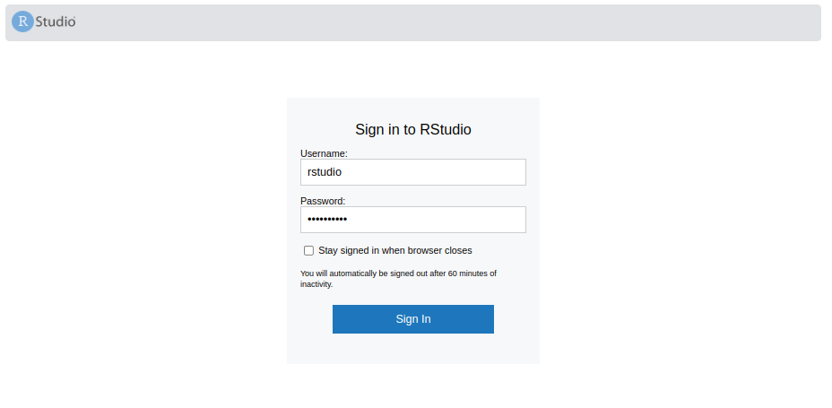
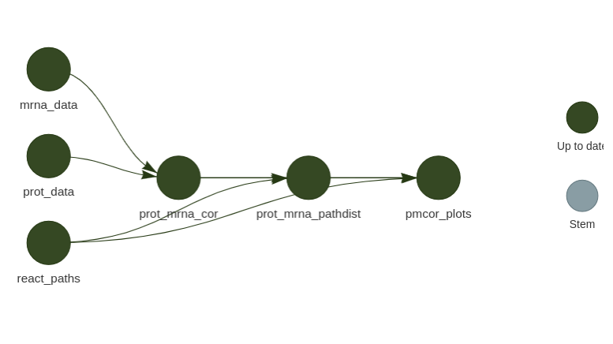

# Reproducibility report for cit_blca_proteomics

We used `docker` and the R `targets` pipeline manager for reproducible graphics and analyses. For more information, you can consult the documentation: <https://books.ropensci.org/targets/>

## Setup

A docker image contains the environment with R and package versions that were used to generate the results in the manuscript. All data and additional code needs to be mounted into the environment.

For `docker` installation instructions, see: <https://docs.docker.com/get-docker/>

Now, download the image by running on terminal:

```
docker pull csgroen/blca_proteomics
```

Now download all pipeline files from Github. 

```{bash eval=FALSE}
git pull https://github.com/csgroen/cit_blca_proteomics.git
```

We can mount this directory into the docker environment and run any analyses there. When you launch the docker container, it will allow you to launch Rstudio on the browser with the necessary environment.

To launch, use:

```
docker run --rm \
           -v path/to/cit_blca_proteomics/analysis:/home/rstudio/project \
           -p 8787:8787 \
           -e PASSWORD=somepassword \
           -e USERID=$UID \
           csgroen/blca_proteomics
```

where:

+ `"/path/to/cit_blca_proteomics/analysis"` is an example *absolute path* to the data downloaded from Github, that will be mounted on `/home/rstudio/project`; 
+ `-p 8787:8787` is the port for accessing Rstudio server on the browser;
+ `-e PASSWORD=somepassword` is the password that will need to be provided to the Rstudio section to log-in (of course, you can change it);
+ `-e USERID=$UID` sets the docker user ID as the same as the host user ID, to avoid permission problems when reading/writing files to the mounted volume.

Once the above command is executed, **go to `localhost:8787` on your browser** and use `username: rstudio` and `password: somepassword` (or better yet, your changed password) to log-in.

{width="60%"}

Now you'll be logged into Rstudio server with the complete necessary environment to run the pipeline.

## Run targets pipeline

All results are available individually in the `results` folder. Each analysis or figure is a "target". For all targets in the pipeline, see the `_targets.R` file for target names.

Before anything, set the working directory in R and setup:

```
setwd("~/project")
library(targets)
R.utils::sourceDirectory("functions")
```

**Note:** Say "No" to `needs` loading itself to avoid an error.

To re-build a particular target and it's upstream dependencies, run `tar_make("target_name")`. For example:

```{r eval=FALSE}
tar_make("pmcor_plots")
```

re-runs all code to generate Figure 1B and all its dependencies.

---

If you'd like to re-create all targets from scratch and analyze them (***WARNING***: this will take a long time as it will reproduce *all* analyses), run:

```
tar_make()
```

## Get targets

To see specific results, you can either load them into your environment once they've been rebuilt:

```
tar_load("pmcor_plots")
pmcor_plots
```

Or check the plot in `results/fig1/` directory.

## Inspect pipeline dependencies

If you'd like to inspect a target up-stream of a reported result, you may want to look at the target dependency graph:

```
tar_visnetwork(names = "pmcor_plots", targets_only = TRUE)
```

{width="60%"}
\break

From this, you can infer the name of a desired upstream target, and inspect it:

```{r}
tar_load(prot_mrna_pathdist)
head(prot_mrna_pathdist)
```

## Note on Cached results

Some results are cached in `cached_results` to speed up the pipeline re-computation (notably: `MOFA` results and `ConsensusClusterPlus` results). You may inspect these and re-run them by checking the original code provided.

## License

Code for every single analysis and plot is provided in the `functions` (or possibly `aux_functions`) directories. All code is open source under CC-BY 4.0, so you may use, share and modify it with proper attribution. See attached license file for more details.
